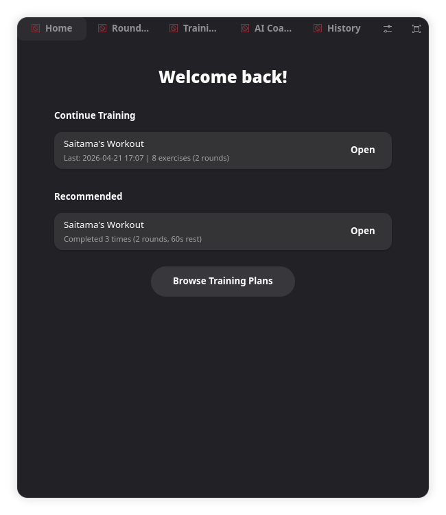
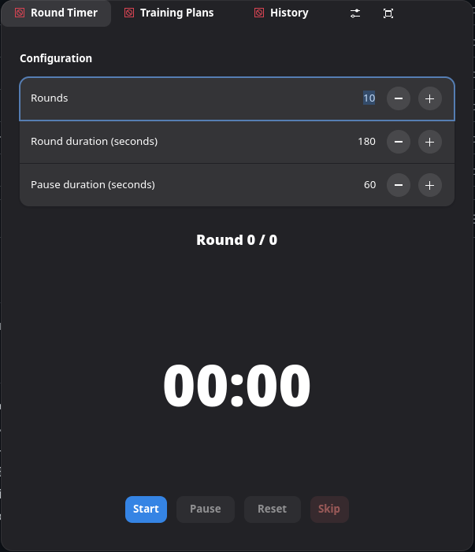
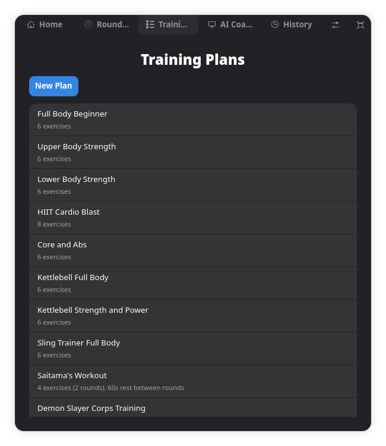
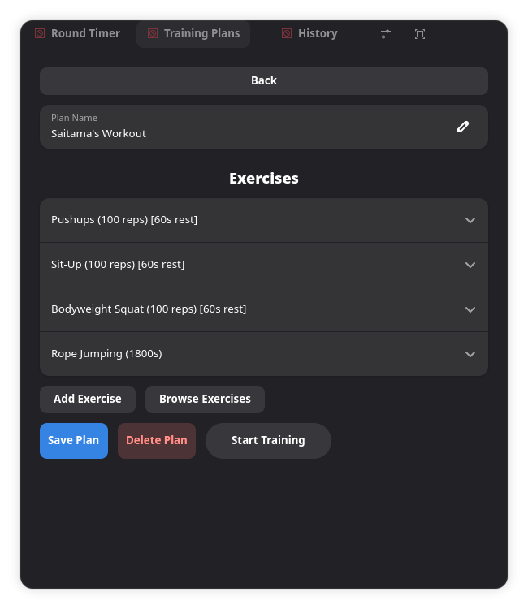
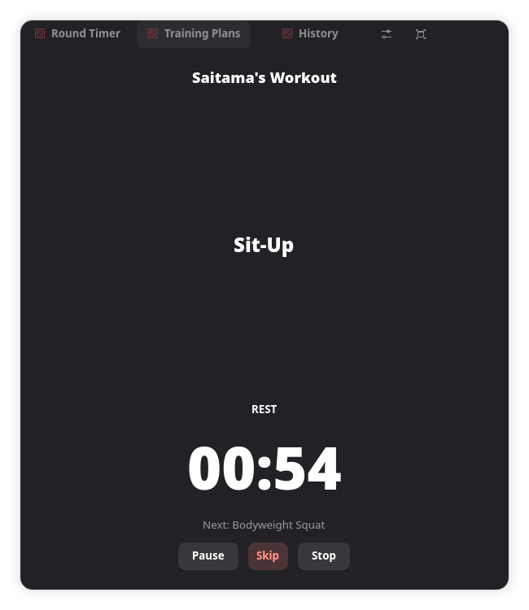
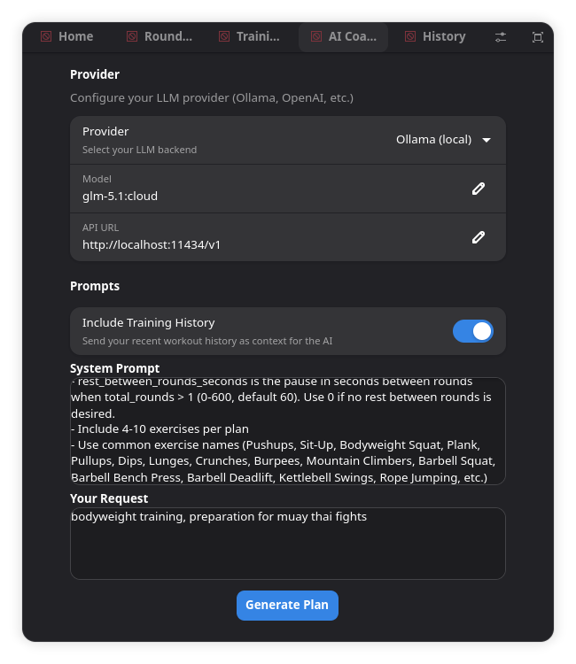
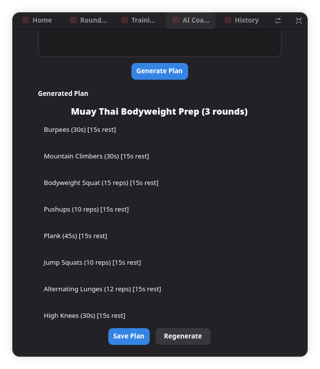
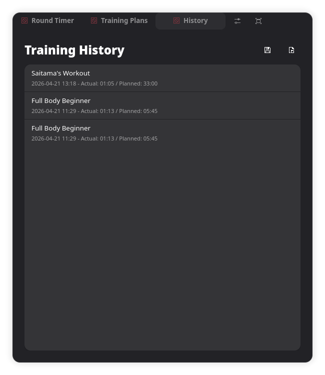
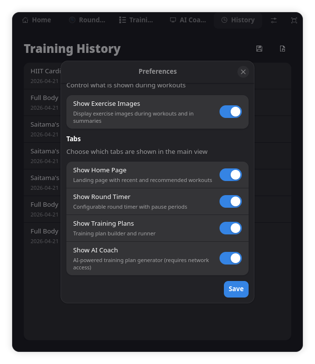

# Workout Timer

A sport training application for Linux, built with GTK 4 and libadwaita.

## Features

- **Home Page** — Quick access to continue your last workout, recommended plans, and browse all plans
- **Round Timer** — Configurable rounds, duration, and pause periods with audio alerts
- **Training Plan Builder** — Create plans with timed and rep-based exercises, multi-round circuits with configurable rest between rounds
- **AI Coach** — Generate training plans with local LLMs (Ollama) or OpenAI-compatible APIs
- **Built-in Exercise Database** — 873 exercises with images from [free-exercise-db](https://github.com/yuhonas/free-exercise-db) (Unlicense)
- **11 Default Training Plans** — Including pop culture-inspired plans (Saitama, Demon Slayer Corps, Rocky)
- **Multi-Round Circuits** — Repeat all exercises for multiple rounds with configurable rest between rounds
- **Training History** — Per-session detail with per-exercise logging (actual vs planned), CSV export/import
- **Customizable Sounds** — Choose different sounds for round start, round end, exercise complete, round break, and training complete
- **Fullscreen Mode** — F11 or header bar button for distraction-free workouts
- **Add Custom Exercises** — Add your own exercises with custom images
- **Tab Visibility** — Show or hide tabs (Home, Timer, Training Plans, AI Coach) in Preferences

## Screenshots

### Home Page


### Round Timer


### Training Plans


### Training Plan Editor


### Training Plan Runner


### AI Coach


### AI Coach — Generated Plan


### Training History


### Settings


## Installation

### Flatpak (recommended)

Build and install locally:

```bash
# Install runtimes
flatpak install flathub org.gnome.Platform//50 org.gnome.Sdk//50
flatpak install flathub org.flatpak.Builder

# Build and install
flatpak run --command=flatpak-builder org.flatpak.Builder \
  --user --install --force-clean build-dir/ io.github.NikolausB.WorkoutTimer.yml

# Run
flatpak run io.github.NikolausB.WorkoutTimer
```

### Run from source

```bash
bash run.sh
```

Requires: Python 3.9+, GTK 4, libadwaita, GStreamer, PyGObject

## Multi-Round Circuits

Training plans support multiple rounds. Set "Total Rounds" in the plan editor to repeat all exercises multiple times. You can also configure "Rest Between Rounds" — a pause between rounds with a countdown timer and sound indicators.

The HIIT Cardio Blast default plan uses 3 rounds with 30 seconds rest between each round.

## AI Coach

The AI Coach tab (hidden by default, enable in Preferences) lets you generate training plans using:

- **Ollama** (local) — Run LLMs locally with zero API key required
- **OpenAI-compatible** — Any provider with an OpenAI-compatible `/v1/chat/completions` endpoint

Generated plans are automatically matched against the built-in exercise database for images, and can be saved directly to your training plans.

## Default Training Plans

| Plan | Exercises | Rounds | Focus |
|------|-----------|--------|-------|
| Full Body Beginner | 6 | 1 | Bodyweight basics |
| Upper Body Strength | 6 | 1 | Pushups, curls, rows |
| Lower Body Strength | 6 | 1 | Squats, lunges, calf raises |
| HIIT Cardio Blast | 8 | 3 | High-intensity intervals, 30s rest between rounds |
| Core and Abs | 6 | 1 | Crunches, planks, leg raises |
| Kettlebell Full Body | 6 | 1 | Swings, cleans, presses |
| Kettlebell Strength and Power | 6 | 1 | Snatches, windmills, Turkish get-ups |
| Sling Trainer Full Body | 6 | 1 | Suspension trainer exercises |
| Saitama's Workout | 4 | 1 | 100 push-ups, 100 sit-ups, 100 squats, 10km run |
| Demon Slayer Corps Training | 7 | 1 | High-intensity bodyweight circuit |
| Rocky Balboa's Training | 7 | 1 | Jump rope, pushups, dips, lunges, calf raises |

## Credits

See [CREDITS.md](CREDITS.md) for full credits and third-party resources.

## License

MIT